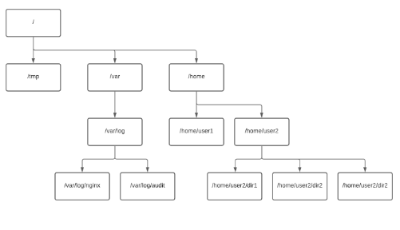

mkdir directory_name -> create a directory with the name "directory_name"

mkdir directory_name{1..10} -> create 10 directories with the same name and a number at the end

mkdir parentdir/childir{01..100} -> create 100 directories with the same name and a number at the end in a parent directory

`pwd` -> print the current working directory
cd directory_name -> change the current working directory to "directory_name"

cd ~  = cd $HOME = cd /root

rmdir directory_name -> remove a directory with the name "directory_name"

rmdir /directory_name/* -> remove all files from a directory

rmdir -r directory_name -> -r means go recursively through directories (and threat everything as file)

rmdir -f directory_name -> remove a directory with the name "directory_name" and all its content without asking for confirmation

rmdir -rf directory_name -> remove a directory with the name "directory_name" and all its content without asking for confirmation
